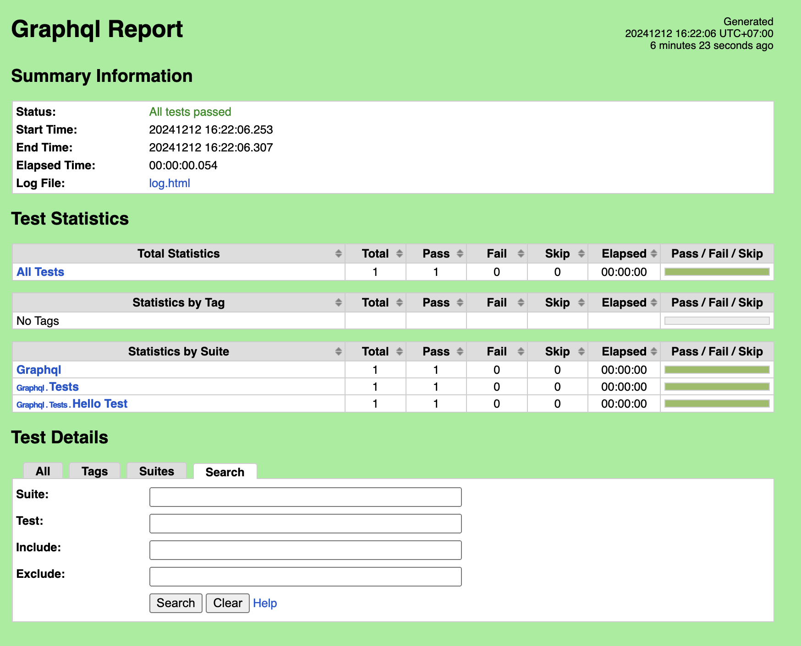

# Robot Automation Testing

## Quickstart

1. Clone the repository:

    ```bash
    git clone 
    ```

2. Start the virtual environment using Poetry:

    ```bash
    cd robot_automation_testing
    poetry shell
    ```

3. Install the required dependencies:

    ```bash
    poetry install
    ```

4. Run the sample test suite:

    Start the sample GraphQL server:

    ```bash
    cd sample-graphql-api
    poetry shell
    poetry install
    python app.py
    ```

    Run the sample test suite:

    ```bash
    cd robot_automation_testing
    poetry run robot --outputdir reports src/test_suites/graphql/
    ```

5. View the test report:

    Open the generated HTML report in your browser:

    ```bash
    open reports/report.html
    ```

    